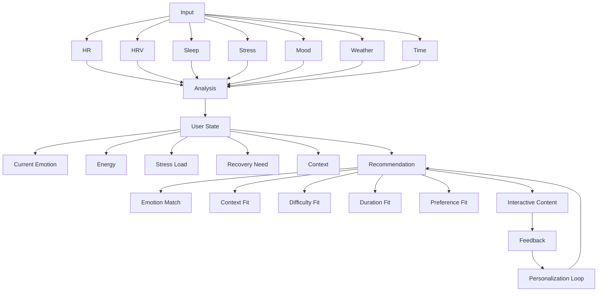

# MomentTune ArtBox Recommendation Engine

ArtBox recommendations connect MomentTune signals to interactive content.

## Data Flow



## Scoring Inputs

- Emotion match
- Stress fit
- Focus fit
- Sleep fit
- Energy fit
- Time of day
- Weather context
- User preference
- Completion history
- Freshness

## Score Formula

```ts
recommendationScore =
  emotionMatch * 0.30 +
  contextFit * 0.20 +
  personalizationFit * 0.20 +
  difficultyFit * 0.10 +
  durationFit * 0.10 +
  freshness * 0.10;
```

## Feedback Signals

- Session started
- Session completed
- Session exited early
- Duration
- Interaction count
- Sound usage
- Before mood
- After mood
- User rating
- Physiological change when available

## Recommendation Contract

Every content item must provide:

- Source emotion
- Target emotion
- Category
- Duration
- Difficulty
- Interaction type
- Stress fit
- Focus fit
- Sleep fit
- Recommendation weight
- Accessibility support
