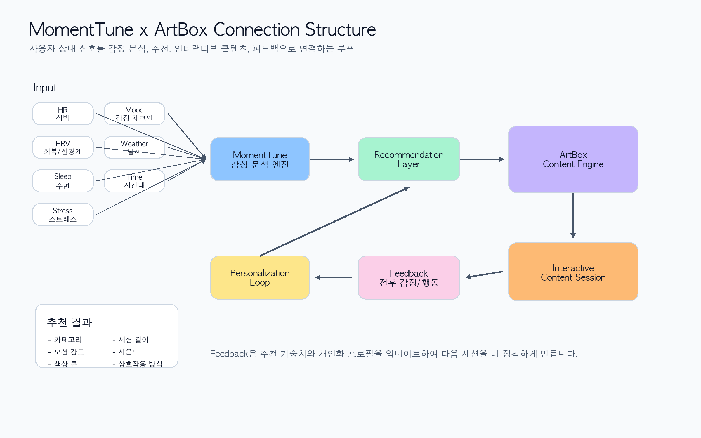
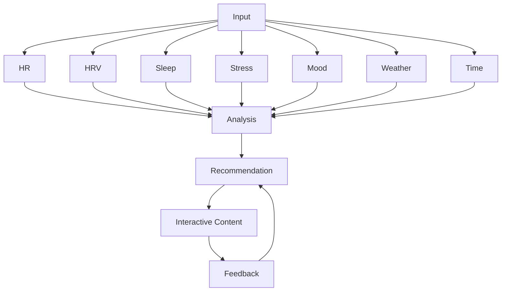

# MomentTune ArtBox Recommendation Engine

ArtBox 추천은 MomentTune의 사용자 상태 신호를 인터랙티브 콘텐츠로 연결합니다.

## 연결 구조 이미지



## Data Flow



## Scoring Inputs

- emotion match
- stress fit
- focus fit
- sleep fit
- energy fit
- time of day
- weather context
- user preference
- completion history
- freshness

## Score Formula

```ts
recommendationScore =
  emotionMatch * 0.30 +
  contextFit * 0.20 +
  personalizationFit * 0.20 +
  difficultyFit * 0.10 +
  durationFit * 0.10 +
  freshness * 0.10;
```

## Feedback Signals

- session started
- session completed
- session exited early
- duration
- interaction count
- sound usage
- before mood
- after mood
- user rating
- available physiological change

## Recommendation Contract

모든 콘텐츠는 아래 값을 제공해야 합니다.

- source emotion
- target emotion
- category
- duration
- difficulty
- interaction type
- stress fit
- focus fit
- sleep fit
- recommendation weight
- accessibility support
